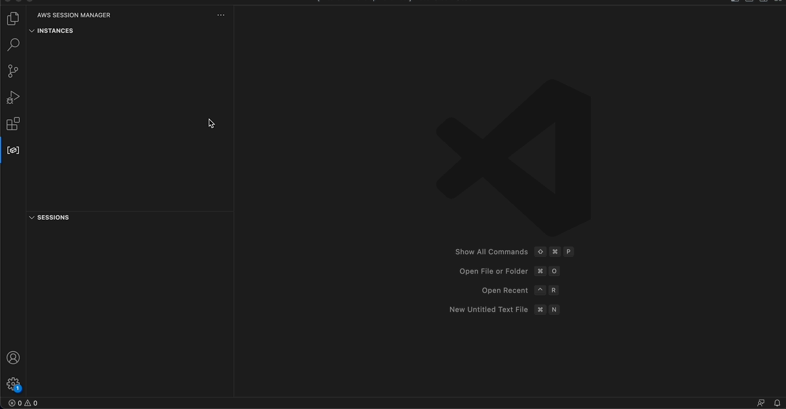
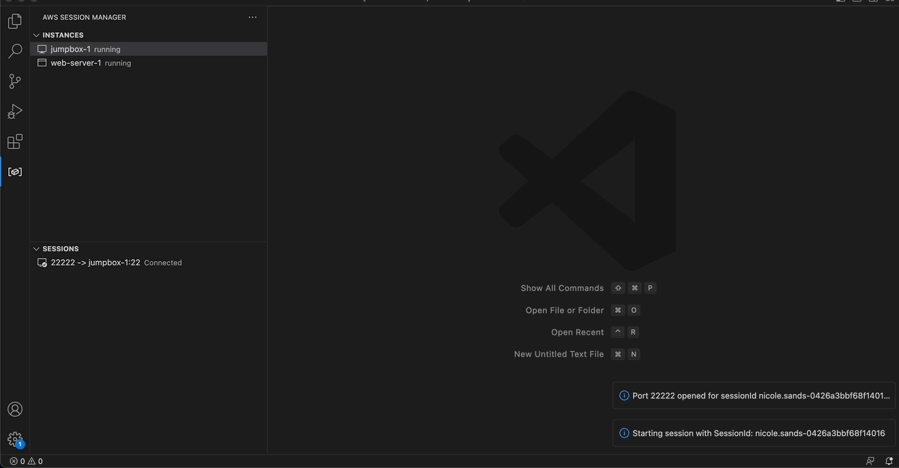

# AWS SSM port forwarder README

## Features

Create and terminate AWS SSM port forwarding sessions from a list of running EC2 instances.

### Select AWS profiles and regions
   

### Start SSM session

   

`Connect to Port` is equivalent to AWS CLI command:

```
aws ssm start-session `
 --target <instance-id> `
 --document-name AWS-StartPortForwardingSession `
 --parameters "portNumber=[22],localPortNumber=[22222]" `
 --profile default `
 --region "us-east-1"
```

`Connect to Remote Host` is equivalent to AWS CLI command:

```
aws ssm start-session `
 --target <instance-id> `
 --document-name AWS-StartPortForwardingSessionToRemoteHost `
 --parameters "host=[my-rds-db.us-east-1.rds.amazonaws.com],portNumber=[5432],localPortNumber=[25432]" `
 --profile default `
 --region "us-east-1"
```


### Terminate SSM session
   

## Requirements

- [AWS SSM plugin](https://docs.aws.amazon.com/systems-manager/latest/userguide/session-manager-working-with-install-plugin.html) installed

- Valid, unexpired credentials in the ~/.aws/credentials or ~/.aws/config files


## Release Notes

### 0.0.1

Initial release

### 0.0.2

Update documentation

### 0.0.3

Improve invalid or expired AWS profile error handling
