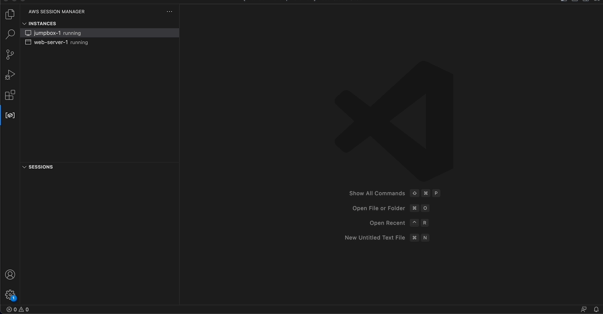

# AWS SSM port forwarder README

## Features

Create and terminate AWS SSM port forwarding sessions from a list of running EC2 and SSM Managed instances.

### Select AWS profiles and regions
   

### Start SSM session

   

`Connect to Port` is equivalent to AWS CLI command:

```
aws ssm start-session `
 --target <instance-id> `
 --document-name AWS-StartPortForwardingSession `
 --parameters "portNumber=[22],localPortNumber=[22222]" `
 --profile default `
 --region "us-east-1"
```

`Connect to Remote Host` is equivalent to AWS CLI command:

```
aws ssm start-session `
 --target <instance-id> `
 --document-name AWS-StartPortForwardingSessionToRemoteHost `
 --parameters "host=[my-rds-db.us-east-1.rds.amazonaws.com],portNumber=[5432],localPortNumber=[25432]" `
 --profile default `
 --region "us-east-1"
```

`Connect via RDP` is equivalent to the below AWS CLI command. It is available on Windows EC2 instances only. If the session connection is successful and RDP usage is enabled in Settings for this extension, Microsoft Remote Desktop (if installed) will open and automatically connect to remote host port 3389 using a randomly chosen and available local host port (also configurable in Settings). Option currently supported on Windows and MacOS only.

```
aws ssm start-session `
 --target <instance-id> `
 --document-name AWS-StartPortForwardingSession `
 --parameters "portNumber=[3389],localPortNumber=[22222]" `
 --profile default `
 --region "us-east-1"
```

### Terminate SSM session
   

## Requirements

- [AWS SSM plugin](https://docs.aws.amazon.com/systems-manager/latest/userguide/session-manager-working-with-install-plugin.html) installed

- Valid, unexpired credentials in the ~/.aws/credentials or ~/.aws/config files

- Microsoft Remote Desktop if the RDP usage option is enabled in Settings
